# Reto 02

Elija un problema de la vida real (sistema de gestión de biblioteca, negocio de compra-venta, automóvil, etc) que se pueda modelar a través de objetos y clases. Plantee las relaciones de clases, composiciones, propiedades y comportamientos del sistema en uno más diagramas tipo UML.

El siguiente diagrama de clases, expresa las relaciones en una escuela, por ejemplo, entre maestro y estudiante.

# Diagrama de Clases:

